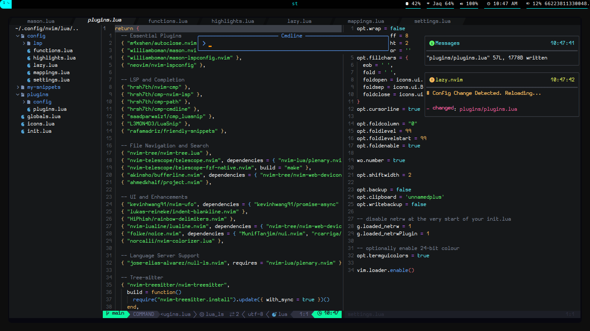

# Neovim Custom Configs

**Welcome to my Neovim custom configuration repository!** This setup is designed to transform your Neovim experience into a lightning-fast, feature-rich, and visually stunning coding environment.

## Dashboard



## Install dependencies
- [Neovim](https://github.com/neovim/neovim/tags) (0.10.0+ or Stable)
- [MSYS2](https://www.msys2.org/) (C++ *Windows* Compiler)
- [Git](https://git-scm.com/downloads)
- [Node.js](https://nodejs.org/en/)
- [Ripgrep](https://github.com/BurntSushi/ripgrep)
- [Lazygit](https://github.com/jesseduffield/lazygit)
- [Nerd Font](https://github.com/ryanoasis/nerd-fonts)
- [Windows Terminal](https://apps.microsoft.com/store/detail/windows-terminal/9N0DX20HK701?hl=en-id&gl=id) (*Windows*)
- [Powershell](https://apps.microsoft.com/store/detail/powershell/9MZ1SNWT0N5D?hl=en-id&gl=id) (*Windows*)
- [NvChad](https://nvchad.com/)

## Config Linux (Linux Debian Based)

- Make sure the account is administrator

```bash
sudo visudo
[nama user] ALL=(ALL:ALL) ALL
[nama user] ALL=(ALL) NOPASSWD:ALL
```

- Install Neovim

- Check GCC availability

```bash
gcc --version
```

- Install git

- Install NodeJS

- Install unzip, ripgrep

- Install Lazygit

## Config Linux / MAC
- Rename Config Original
```bash
mv ~/.config/nvim/lua/custom/ ~/.config/nvim/lua/custom_backup
```
- New Clone Config
```bash
git clone https://github.com/Teagar/nvim ~/.config/nvim/lua/custom
```
## Config Windows
- Rename Config Original
```powershell
Rename-Item "$env:LOCALAPPDATA\nvim\lua\custom" "$env:LOCALAPPDATA\nvim\lua\custom_backup"
```
- New Clone Config
```powershell
git clone https://github.com/Teagar/nvim "$env:LOCALAPPDATA\nvim\lua\custom"
```

## Developers

| [Thiago Cerqueira](https://github.com/Teagar) |
| --- |
|  |

