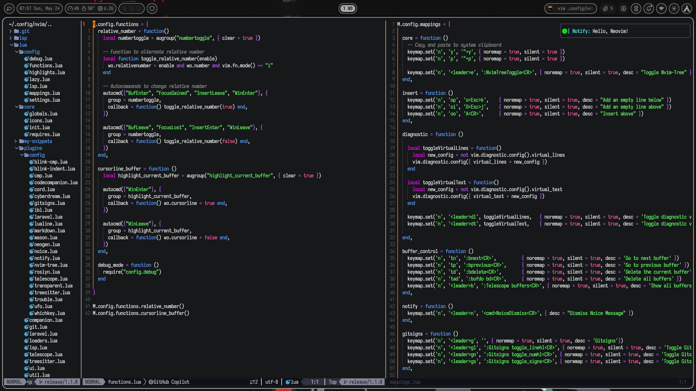

<div align="center">

# Teagar's Neovim Config


<br/>
<br/>

> *A lightning-fast, feature-rich and visually stunning Neovim setup*

</div>

---

## Preview



---

## Features

-  **Blazing fast startup** via [lazy.nvim](https://github.com/folke/lazy.nvim) with lazy-loading
-  **AI-powered coding** with GitHub Copilot + CodeCompanion
-  **Beautiful UI** powered by Cyberdream theme, Noice, and nvim-notify
-  **Treesitter** for precise, context-aware syntax highlighting
-  **Fuzzy everything** with Telescope
-  **Full LSP** via Mason + Roslyn (C# support built-in)
-  **Clean statusline** with Lualine
-  **File explorer** with nvim-tree
-  **Git integration** via Neogit, Gitsigns and Diffview
-  **Auto-pairs, colorizer, icons** and more quality-of-life goodies
-  **vim-be-good** - sharpen your Vim skills without leaving the editor
-  **Discord Rich Presence** via cord.nvim
-  **Laravel support** out of the box

---

## Plugins

| Category | Plugin |
|---|---|
| **Plugin Manager** | [lazy.nvim](https://github.com/folke/lazy.nvim) |
| **Colorscheme** | [cyberdream.nvim](https://github.com/scottmckendry/cyberdream.nvim) |
| **Statusline** | [lualine.nvim](https://github.com/nvim-lualine/lualine.nvim) |
| **File Explorer** | [nvim-tree.lua](https://github.com/nvim-tree/nvim-tree.lua) |
| **Fuzzy Finder** | [telescope.nvim](https://github.com/nvim-telescope/telescope.nvim) |
| **Syntax** | [nvim-treesitter](https://github.com/nvim-treesitter/nvim-treesitter) |
| **LSP / Installer** | [mason.nvim](https://github.com/williamboman/mason.nvim), [roslyn.nvim](https://github.com/seblj/roslyn.nvim) |
| **Autocomplete** | [blink.cmp](https://github.com/Saghen/blink.cmp) |
| **Formatting / Lint** | [none-ls.nvim](https://github.com/nvimtools/none-ls.nvim) |
| **AI Coding** | [copilot.vim](https://github.com/github/copilot.vim), [codecompanion.nvim](https://github.com/olimorris/codecompanion.nvim) |
| **Git** | [neogit](https://github.com/NeogitOrg/neogit), [gitsigns.nvim](https://github.com/lewis6991/gitsigns.nvim), [diffview.nvim](https://github.com/sindrets/diffview.nvim) |
| **Find & Replace** | [grug-far.nvim](https://github.com/MagicDuck/grug-far.nvim) |
| **Markdown** | [render-markdown.nvim](https://github.com/MeanderingProgrammer/render-markdown.nvim) |
| **UI / Notifications** | [noice.nvim](https://github.com/folke/noice.nvim), [nvim-notify](https://github.com/rcarriga/nvim-notify), [nui.nvim](https://github.com/MunifTanjim/nui.nvim) |
| **Keybinding Helper** | [which-key.nvim](https://github.com/folke/which-key.nvim) |
| **Docs Generator** | [neogen](https://github.com/danymat/neogen) |
| **Indentation** | [blink.indent](https://github.com/Saghen/blink.indent) |
| **Transparency** | [transparent.nvim](https://github.com/xiyaowong/transparent.nvim) |
| **Autopairs** | [nvim-autopairs](https://github.com/windwp/nvim-autopairs) |
| **Colorizer** | [nvim-colorizer.lua](https://github.com/norcalli/nvim-colorizer.lua) |
| **Icons** | [nvim-web-devicons](https://github.com/nvim-tree/nvim-web-devicons) |
| **Utilities** | [plenary.nvim](https://github.com/nvim-lua/plenary.nvim), [mini.nvim](https://github.com/echasnovski/mini.nvim) |
| **Laravel** | [laravel.nvim](https://github.com/adalessa/laravel.nvim) |
| **Discord Presence** | [cord.nvim](https://github.com/vyfor/cord.nvim) |
| **Vim Practice** | [vim-be-good](https://github.com/ThePrimeagen/vim-be-good) |

---

## Structure

```
~/.config/nvim/
├── init.lua               # Entry point
├── lazy-lock.json         # Plugin lockfile
├── lsp/                   # LSP server configs
└── lua/
    └── core/
        ├── init.lua
        ├── globals.lua
        └── requires.lua
            ├── icons.lua
            └── config/
                ├── settings.lua
                ├── lazy/
                │   └── plugins/
                │       └── init.lua
                ├── mappings.lua
                ├── functions.lua
                ├── highlights.lua
                └── lsp.lua
```

---

## Installation

**Requirements:**
- Neovim >= 0.12
- Git
- A [Nerd Font](https://www.nerdfonts.com/) (for icons)
- Node.js (for Copilot and some LSPs)
- `ripgrep` (for Telescope live grep)

```bash
# Backup your existing config (if any)
mv ~/.config/nvim ~/.config/nvim.bak

# Clone the repository
git clone -b release/1.1.0 https://github.com/Teagar/nvim.git ~/.config/nvim

# Launch Neovim - lazy.nvim will install all plugins automatically
nvim
```

---

## Configuration

All configuration lives under `lua/core/config/`. Each concern is separated into its own file:

| File | Purpose |
|---|---|
| `settings.lua` | Neovim options (tab width, line numbers, etc.) |
| `mappings.lua` | Custom keybindings |
| `functions.lua` | Utility/helper functions |
| `highlights.lua` | Custom highlight overrides |
| `lsp.lua` | LSP client setup |
| `lazy/plugins/` | Individual plugin configs |

---

## Contributing

Pull requests are welcome! For major changes, please open an issue first to discuss what you'd like to change.

---

## License

Distributed under the MIT License. See `MIT license` for more information.

---

<div align="center">

Made with love and lots of `:wq`|`:x` by [Teagar](https://github.com/Teagar)

</div>
